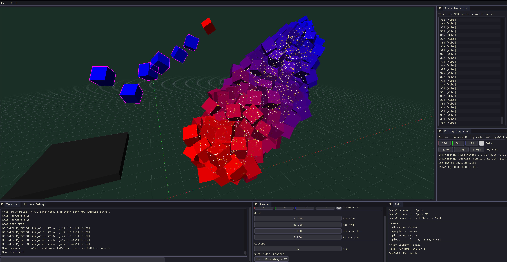
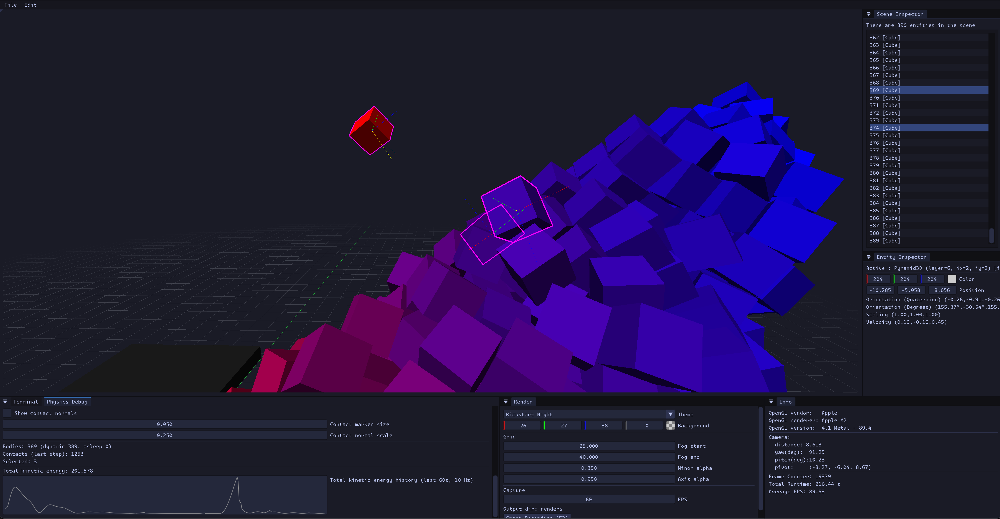
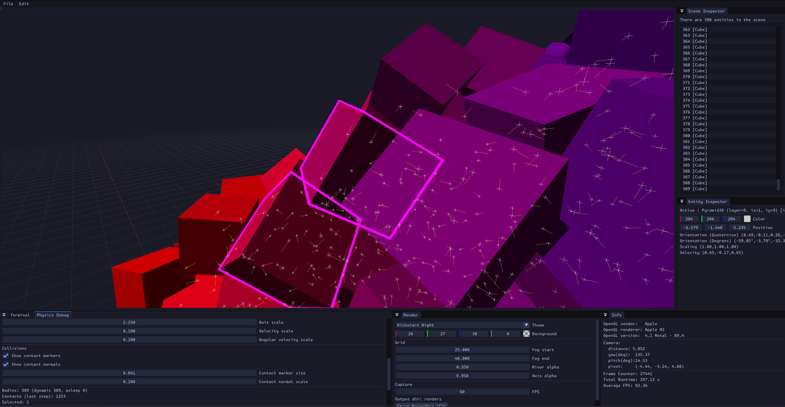
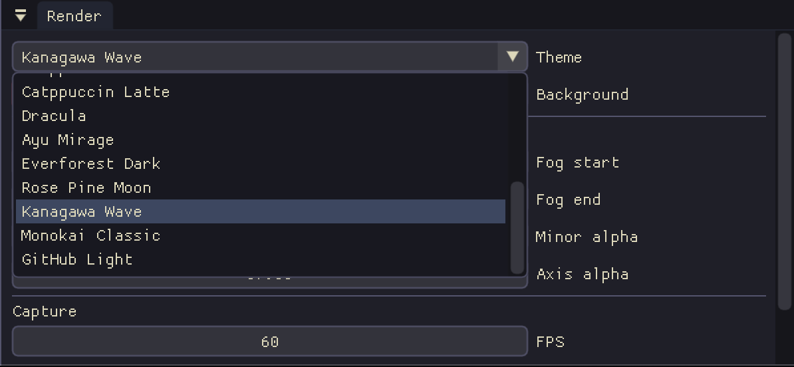

# Physically Based Animations

## Functionality
### Interactivity
Multi selection, grabbing with free and axis located moving.



### Physics Debug



### UI

Supports dynamically switching editor theme and loading in themes from a config file (`assets/ui/themes.json`)
```json
{
  "default": "Blender Dark",
  "themes": [
    {
      "name": "Blender Dark",
      "base": "dark",
      "colors": {
        "Text": "0xE6E6E6FF",
        "TextDisabled": "0xA6A6A6FF",
        "WindowBg": "0x353535FF",
        "ChildBg": "0x333333FF",
        "PopupBg": "0x252525FF",
        "Border": "0x232323FF",
        "BorderShadow": "0x00000000",
    ...
```

## Videos
* https://www.youtube.com/watch?v=1fZnTQ-wU24
* https://www.youtube.com/watch?v=uKSDHguqzIE
* https://www.youtube.com/watch?v=C_mCMDn9qz0

## Coding Standard
* The coding style is heavily inspired by Herb Sutters AAA (almost always auto) style (see [SutterAAA])
* Compile with warnings as errors and compiler flags active
* Every variable should be brace initialised unless it has an auto type then it must be assignment initialised
  * This also applies to loop variables, e.g. use for(usize x{0zu}; ...) instead of for(usize x = 0; ...)
* Implicit conversions are to be avoided as much as possible (for example use correct string literals `usize x{0zu}` instead of `usize x{zu}`)
* To be more aligned with fstring formatting use `zu` instead of `uz` string literal
* The gsl (see [GSL]) is used for `narrow_cast` and `Expects`, `Ensures`, which are used to prepare for integration of contracts once C++26 is released.
* Due to the nature of this program most errors will result in the program terminating. If a subsystem will later be built with error recoverability in mind then errors as values (via `std::expected`) will be preferred to exceptions.

## Building
```
cmake -S . -B build -DCMAKE_BUILD_TYPE=Debug
```

```
cmake --build build -j
```

## Notes
### NLohnman ADL serializer
When I want to serialise a type that I didn't define (e.g. glm::vec3) then the lookup on `to_json(glm::vec3)` is going to look at the glm namespace and never see mine. For that reason NLohmann uses a trick to make the ADL (Argument Dependent Lookup) work. See 

It does the following:
```
namespace nlohmann
{
template <>
struct adl_serializer<glm::vec3>
{
    static void to_json(json& j, const glm::vec3& v) {}
    static void from_json(const json& j, glm::vec3& v) {}
};
```

See 
* https://github.com/nlohmann/json?tab=readme-ov-file#how-do-i-convert-third-party-types
* https://en.cppreference.com/w/cpp/language/adl.html

### DearImGui Begin() API
DearImGUI has a bit unfortunate API design for "Begin*" type functions.

For things like `ImGui::Begin()`, `ImGui::BeginChild()` they ALWAYS pop onto the stack and ALWAYS have to have the corresponding `ImGui::End*()` call, so they must be unconditionally closed while containers like `ImGui::BeginTable()`, `ImGui::BeginMenu()` only get created if and only if that call returns true so they should be conditionally closed:
```cpp
if(ImGui::BeginChild(/*args*/)){
    /*content*/
}
ImGui::EndChild();
```
vs.
```cpp
if(ImGui::BeginTable(/*args*/)){
    /*content*/
    ImGui::EndTable();
}
```

## References (Papers) 
* [PBRT4] Physically Based Rendering, 4th Edition — Matt Pharr, Wenzel Jakob, Greg Humphreys — https://pbr-book.org/4ed/
  * Rendering basics, camera transforms, ray–shape intersection, shading
* [Catto05] Iterative Dynamics with Temporal Coherence — Erin Catto, 2005 — https://box2d.org/files/ErinCatto_IterativeDynamics_GDC2005.pdf
  * Sequential impulse solver, constraint iteration, real-time rigid body contacts
* [Ericson04] Real-Time Collision Detection — Christer Ericson, 2004 — https://realtimecollisiondetection.net/
  * Broadphase, narrowphase, SAT, geometric robustness
* [Müller07] Position Based Dynamics — Matthias Müller, Bruno Heidelberger, Marcus Hennix, John Ratcliff, 2007 — https://matthias-research.github.io/pages/publications/posBasedDyn.pdf
  * Position-level constraint solving, alternative to impulse-based rigid body dynamics
* [Baraff97] Physically Based Modeling: Principles and Practice — Andrew Witkin, David Baraff, 1997 (SIGGRAPH Course Notes) — https://www.cs.cmu.edu/~baraff/sigcourse/
  * Rigid Body Dynamics II: Motion with Constraints — https://www.cs.cmu.edu/~baraff/sigcourse/notesd2.pdf
* [Box2D] Box2D Physics Engine — Erin Catto - https://github.com/erincatto/box2d  
* [SoftwareDesign] C++ Software Design - Klaus Iglberger, 2023

## References
* [SutterAAA] https://herbsutter.com/2013/08/12/gotw-94-solution-aaa-style-almost-always-auto/
* https://www.scs.stanford.edu/~dm/blog/param-pack.html
* https://en.cppreference.com/w/cpp/language/value_category.html#Forwarding_references
* [GSL] https://github.com/microsoft/GSL

### Assets
* PolyHaven
    * https://polyhaven.com/a/marble_bust_01
    * https://polyhaven.com/a/clean_asphalt
* https://monaspace.githubnext.com
